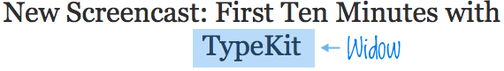

The browser does a remarkable job of layouting text, but still has many missing pieces that exists are standard for printed text.
I've collected many tips and strategies for improving readability.

## Avoiding windowed sentences

In typography, a _widow_ is a sentence line or word that appears alone at the top of a page, column or line,
and is separated by the rest of the paragraph.

<div class="pad4">



<figcaption>A widow word example</figcaption>

</div>

CSS has a native `widows` property, but it only works for with **multi-column** layouts or `print` styles.
The `widows` property is the minimum number of lines in a paragraph split on the new page/column.

To avoid words breaking separately into a new line, use the non-breaking space separator `&nbsp;`(\u00A0) between words.

I use the following function for React or server side rendering:

<div class="grid2 align-center">
<div class="item">

```ts
function avoidWidowedWords(text: string, widows: number = 3): string {
  const words = text.split(' ');
  const [first, last] = [words.slice(0, -widows), words.slice(-widows)];
  return first.join(' ') + ' ' + last.join('\u00A0');
}
```

</div>
<div class="item surface surface1 pad4 m-auto">
  <h4>Title's can break nicely without&nbsp;widowed&nbsp;words</h4>
</div>
</div>

## Limit text to N lines

Also called [Line clamping](https://caniuse.com/?search=line-clamp), works in all major browsers in 2021 🥰.

The feature is behind prefix `-webkit` and only works in combination with `display: -webkit-box;`

<style>
  .titleMax2Lines {
  overflow: hidden;
  text-overflow: ellipsis;
  display: -webkit-box;
  -webkit-line-clamp: 2; /* number of lines to show */
  -webkit-box-orient: vertical;
}
</style>

<div class="grid2 align-center">
<div class="item">

```css
.titleMax2Lines {
  overflow: hidden;
  text-overflow: ellipsis;
  display: -webkit-box;
  -webkit-line-clamp: 2; /* number of lines to show */
  -webkit-box-orient: vertical;
}
```

</div>
<div class="item surface surface1 pad4 m-auto">
  <h4 class="titleMax2Lines">Aliqua culpa dolore ullamco voluptate id dolore aliquip sit cupidatat. Officia tempor minim esse incididunt velit ex eu incididunt officia magna aute enim ex. Magna occaecat non deserunt Lorem occaecat sit voluptate adipisicing et culpa anim deserunt. Nisi voluptate magna aliqua excepteur ex adipisicing. Est sunt Lorem pariatur velit veniam anim veniam et excepteur cillum consectetur excepteur.</h4>
</div>
</div>

## Enable kerning and ligatures

To enable kerning and ligatures, use `text-rendering: optimizeLegibility`

```css
body {
  text-rendering: optimizeLegibility;
}
```

## Enable subpixel antialiasing

```css
body {
  -webkit-font-smoothing: antialiased;
  -moz-osx-font-smoothing: grayscale;
}
```
